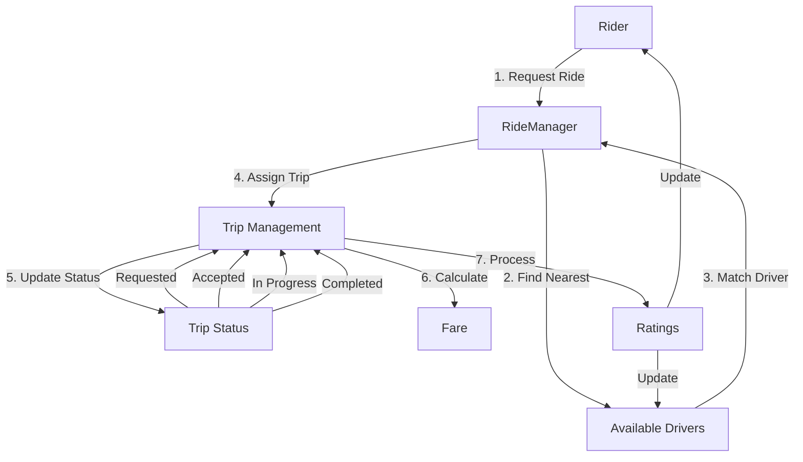

# Ride Sharing System Design

A C++ implementation of a ride-sharing system similar to Uber. This system demonstrates core functionalities of a ride-sharing platform including real-time location tracking, driver-rider matching, payment processing, and rating system.

## System Flow Diagram

```
┌──────────────────┐     ┌───────────────────┐     ┌──────────────────┐
│                  │     │                   │     │                  │
│      RIDER       │     │   RIDE MANAGER    │     │     DRIVER      │
│                  │     │                   │     │                  │
└────────┬─────────┘     └─────────┬─────────┘     └────────┬─────────┘
         │                         │                         │
         │  1. Request Ride       │                         │
         │ ────────────────────>  │                         │
         │                        │                         │
         │                        │  2. Find Nearest        │
         │                        │ ────────────────────>   │
         │                        │                         │
         │                        │  3. Driver Accepts      │
         │                        │ <────────────────────   │
         │                        │                         │
         │                        │                         │
    ┌────▼────────────────────────▼─────────────────────────▼────┐
    │                                                            │
    │                     TRIP MANAGEMENT                        │
    │                                                            │
    │  ┌─────────────────┐     ┌─────────────────┐             │
    │  │   Trip Status   │     │  Fare System    │             │
    │  │                 │     │                 │             │
    │  │  ┌───────────┐  │     │ ┌───────────┐  │             │
    │  │  │ Requested │  │     │ │ Base Fare │  │             │
    │  │  └─────┬─────┘  │     │ └─────┬─────┘  │             │
    │  │        ▼        │     │       ▼        │             │
    │  │  ┌───────────┐  │     │ ┌───────────┐  │             │
    │  │  │ Accepted  │  │     │ │ Distance  │  │             │
    │  │  └─────┬─────┘  │     │ │   Rate   │  │             │
    │  │        ▼        │     │ └─────┬─────┘  │             │
    │  │  ┌───────────┐  │     │       ▼        │             │
    │  │  │   In      │  │     │ ┌───────────┐  │             │
    │  │  │ Progress  │  │     │ │   Time    │  │             │
    │  │  └─────┬─────┘  │     │ │   Rate   │  │             │
    │  │        ▼        │     │ └─────┬─────┘  │             │
    │  │  ┌───────────┐  │     │       ▼        │             │
    │  │  │ Completed │  │     │ ┌───────────┐  │             │
    │  │  └───────────┘  │     │ │  Total    │  │             │
    │  │                 │     │ │   Fare    │  │             │
    │  └─────────────────┘     └─────────────────┘             │
    │                                                            │
    └────────────────────────────┬───────────────────────────────┘
                                 │
                                 ▼
                         ┌───────────────┐
                         │ Rating System │
                         │              │
                         │  Rider Rate  │
                         │   Driver     │
                         │              │
                         │  Driver Rate │
                         │    Rider     │
                         └───────────────┘
```

## System Architecture



## Core Components

### 1. Location Management (`Location.hpp`)
- Handles geographical coordinates (latitude, longitude)
- Calculates distance between two points
- Real-time location updates

### 2. User Management (`User.hpp`)
- User types: Riders and Drivers
- Profile management
- Rating system
- Availability status

### 3. Trip Management (`Trip.hpp`)
- Trip state machine
- Fare calculation
- Start/End trip handling
- Rating collection

### 4. Ride Manager (`RideManager.hpp`)
- Core orchestrator
- Driver-Rider matching
- Trip assignment
- User management

## Implementation Flow

1. **Trip Request**
   ```cpp
   Trip* trip = rideManager.requestTrip(riderId, pickup, destination);
   ```

2. **Driver Assignment**
   ```cpp
   rideManager.acceptTrip(tripId, driverId);
   ```

3. **Trip Progress**
   ```cpp
   rideManager.startTrip(tripId);
   rideManager.endTrip(tripId);
   ```

4. **Rating System**
   ```cpp
   rideManager.rateTrip(tripId, riderRating, driverRating);
   ```

## Sample Output

```
=== Ride Sharing System Demo ===

1. Requesting New Trip
Rider Location: (12.9716, 77.5946)
Destination: (12.9815, 77.6074)

------------------------
Trip ID: KQCW0LVI
Rider: Parth Verma
Driver: Amrit Singh
Status: Accepted
------------------------

[... Trip Progress ...]

Final Ratings:
Rider (Parth Verma) rating: 4.5
Driver (Amrit Singh) rating: 5.0
```

## Features

- [x] Real-time location tracking
- [x] Driver-rider matching
- [x] Trip state management
- [x] Fare calculation
- [x] Rating system
- [x] Location-based driver search
- [x] Trip history tracking


